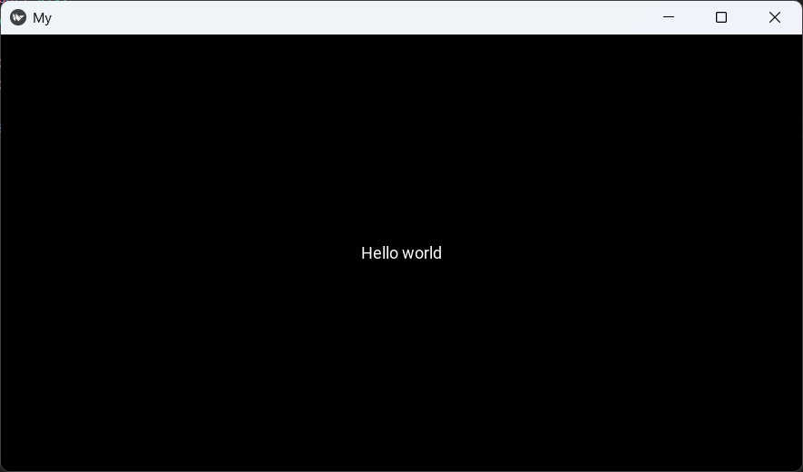

# hugo-kivy
Kivy 리포지토리

- 현재 경로가 잘못되어 로컬 SpringBoot 폴더 내에 있음. 추후 변경할 것 

## Kivy 설치

### pip 설정
```shell
> python -m pip install --upgrade pip setuptools virtualenv
```

### 가상환경 생성
```shell
> python -m virtualenv kivy_venv
```

- 이후 가상환경 실행

### Kivy 설치
```shell
> python -m pip install "kivy[base]" kivy_examples
```

- 이러한 방법은 kivy의 최소한의 의존성만을 설치합니다.
- 오디오, 비디오가 지원되는 버전을 설치하려면 kivy[base,media] 혹은 kivy[full] 과 같이 바꾸어 명령을 실행합니다.

### 데모 프로그램 실행
- 위 과정이 정상적으로 진행되었다면, 이제 파이썬에서 kivy를 사용할 수 있습니다.(import kivy)
- 또는 kivy 예제를 다운받았다면 아래와 같이 데모프로그램을 실행할 수 있습니다.


## Kivy Programming Guide

### Kivy Basics Application
- kivy로 application을 만드는 방법은 간단합니다.

    - [Python](./basics/first_app01.py)

- 실행결과

    
